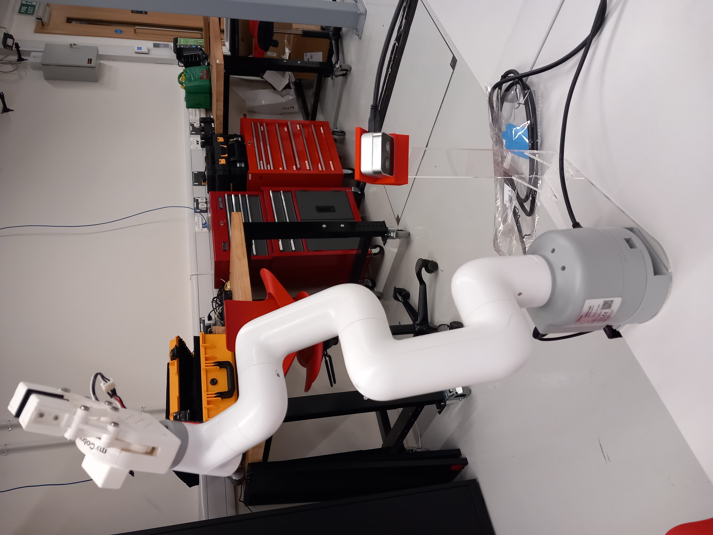
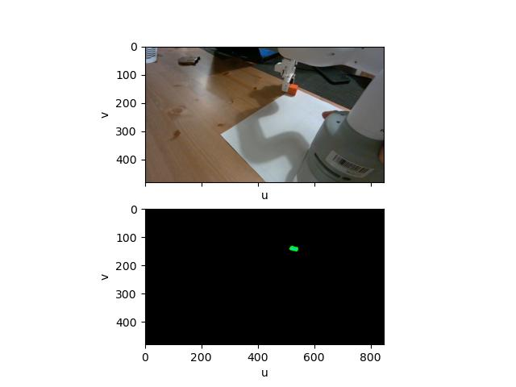
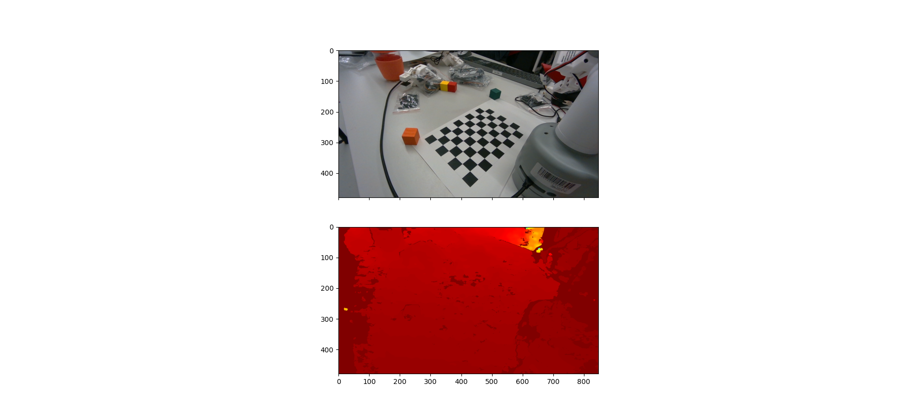
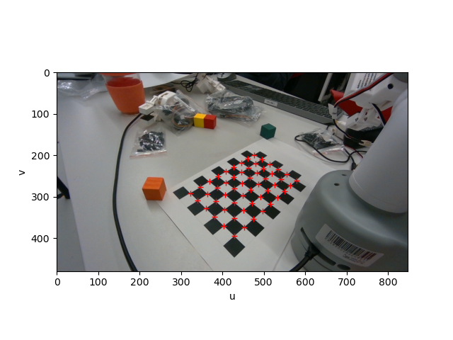
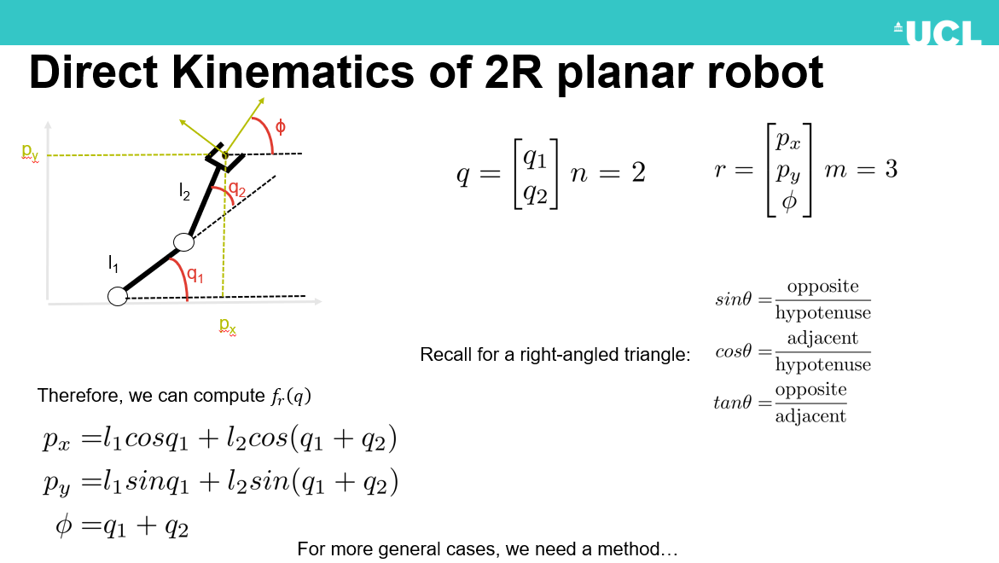

# mycobot
A repo to show off work I did with myCobot preparing it for a hackathon I led for students.

## Inverse Kinematics and Loop Rate
Some of the first work I did was to write a ROS2 package to control the robot arm. The students will connect to the arm via a wireless network and program it in ROS2, so this package was crucial. I quickly realized the robot's loop rate for reading angles and commanding angles was less than 10HZ. To do more advanced control activities this wasn't enough. I realized that by updating the firmware and the client library I was using I could increase the loop rate to 50HZ.

I also implemented a method using pybullet to command the robot using poses instead of joint angles--inverse kinematics. I did this first because this was at the root of a lot of more advanced tasks. See an early video demo [here](https://www.youtube.com/shorts/czrFwaJa2uw).

## Pick and Place with Known Locations
The first work the students will do will be to use functions we supply for forward and inverse kinematics to pick up and place a cube at a known location. This relies on a grid that I designed that lines up perfectly with the robot's coordinate system--which I can do because I have the CAD. Here's a video demo: [here]1(https://www.youtube.com/shorts/_cpvZlviiEE).

## Integrating a Depth Camera
We also have many Intel Real Sense 405s at the lab. The next task the students will do will be picking and placing a camera from locations that are not known in advance. Firstly I had to get the camera images off of the robot to the students' computers. See a video demo: [here](https://www.youtube.com/shorts/cQnuiQ-xzmo).

## Making a Jig for the Depth Camera
I also 3d modelled a jig to mount the depth camera to the robot arm in a known pose. This was also my first laser cutting project--thanks to Simon and Dimi for showing me the ropes.

## Extrinsics of the Depth Camera
From here I had to understand where the depth camera was in relation to the robot. To do this I designed a chessboard that lined up with the robot's coordinate system. I was able to do this because I had the mounting jig CAD. I ran procustes algorithm via scipy-surgercore to get the extrinsics using the known chessboard locations in global space and in the camera's coordinate system. If you want to try calibrating this see the `raw_data.zip` file in this repo and the example calibration script [here](https://github.com/VModugno/mycobot_client/blob/a19a72e5fb9402b9b58c02ea45fdd0fe4e9632e8/mycobot_client_2/mycobot_client_2/camera_extrinsics_via_procrustes.py).
 

## Putting it Together
From here I prepared another activity for the students--picking and placing a cube from a previously unknown location. See a demo [here](https://www.youtube.com/shorts/i0aCBDUobi4).

## Teaching the Students
I also put together various slides to run through with the students the day-of to give them vocabulary and context before the activities.

## All the Links
Here's all the software and CAD I prepared:
* [mycobot_communications](https://github.com/VModugno/mycobot_communications) This repo runs on the arm. It publishes current joint angles, listens for command angles, and publishes the camera data. It runs in a docker image to be more OS independent.
* [mycobot client](https://github.com/VModugno/mycobot_client). This repo runs on student computers. It has wrappers to talk to the arm, do inverse kinematics, talk to pybullet, compute world coordinates of pixels from the camera, serve up camera images in opencv's format, and more. It also has templates students get where they have TODOs they have to complete.
* [mycobot props](https://github.com/VModugno/MycobotProps) this is a repo that contains all the CAD and props that I designed to support the various activities like the camera jig, calibration sheet, and grid sheet.
* [a repo](https://github.com/MZandtheRaspberryPi/realsense_ros2) wrapping the intel real sense python api to publish to ROS2, that I didn't end up using due to problems with the raspberry pi. I ended up using the official ROS2 packages from Intel, the Cpp ones worked on the Pi for me.